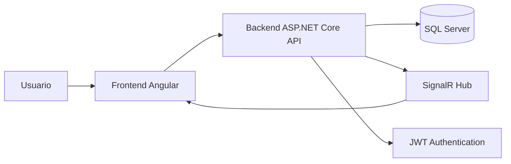

# Documentación Técnica del Proyecto

## 1. Información general

### 1.1 Nombre del proyecto
Sistema de Monitoreo y Alerta Temprana para Riesgos Climáticos

### 1.2 Tipo de solución
Aplicación web full-stack orientada a la supervisión climática, gestión de sensores, alertas y visualización de riesgo mediante un panel de control.

### 1.3 Propósito
El sistema permite:
- monitorear variables ambientales críticas como temperatura, humedad, viento, lluvia y nivel de río;
- registrar y administrar sensores;
- detectar eventos de alto riesgo mediante reglas de alerta;
- consultar el historial de eventos climáticos;
- mantener una auditoría de actividades del sistema;
- centralizar la autenticación y la seguridad del acceso mediante JWT.

### 1.4 Alcance funcional
La solución contempla dos capas principales:
- Frontend en Angular para experiencia de usuario y consumo de servicios REST/SignalR.
- Backend en ASP.NET Core para lógica de negocio, seguridad, persistencia y servicios de monitoreo.

---

## 2. Objetivos del sistema

### 2.1 Objetivo principal
Proporcionar una plataforma para la vigilancia temprana de condiciones climáticas que puedan implicar riesgo para infraestructuras, comunidades o recursos naturales.

### 2.2 Objetivos secundarios
- Centralizar la gestión de sensores y lectura actualizada.
- Automatizar la generación de alertas ante condiciones límite.
- Facilitar la toma de decisiones con indicadores en dashboard.
- Permitir auditoría y trazabilidad de eventos.
- Otorgar autenticación segura con separación por roles.

---

## 3. Arquitectura general

El proyecto se estructura en dos componentes principales y una capa de persistencia:

- Frontend: Angular 20, componentes standalone, Material Design.
- Backend: ASP.NET Core Web API en .NET 10.
- Base de datos: Microsoft SQL Server.
- Comunicación en tiempo real: SignalR.
- Seguridad: JWT + autenticación Bearer.

### 3.1 Diagrama conceptual



### 3.2 Principios de diseño
- Separación de responsabilidades por capas.
- Servicios inyectados con Dependency Injection.
- Modelos y DTOs explícitos para transferencia de datos.
- Repositorio centralizado para acceso a datos.
- Autenticación basada en tokens con roles.
- Arquitectura orientada a API REST con actualización de estado en tiempo real.

---

## 4. Stack tecnológico

### 4.1 Frontend
- Angular 20
- TypeScript
- Angular Material
- RxJS
- @auth0/angular-jwt
- @microsoft/signalr
- Angular Router

### 4.2 Backend
- ASP.NET Core Web API
- C#
- .NET 10
- Entity Framework Core
- SQL Server provider para EF Core
- JWT Bearer Authentication
- Swagger/OpenAPI
- SignalR

### 4.3 Infraestructura y despliegue
- Docker
- Docker Compose
- Nginx (para frontend HTTP)
- Contenedores separados para base de datos, API y frontend

---

## 5. Estructura del repositorio

```text
Monitoreo-y-alerta-temprana-de-riesgos-climaticos/
├── Backend/
│   ├── Controllers/
│   ├── Data/
│   ├── DTOs/
│   ├── Hubs/
│   ├── Models/
│   ├── Repositories/
│   ├── Services/
│   ├── Program.cs
│   ├── appsettings.json
│   ├── docker-compose.yml
│   ├── Dockerfile
│   └── WeatherRisk.Api.csproj
├── Frontend/
│   ├── src/
│   ├── angular.json
│   ├── package.json
│   ├── Dockerfile
│   ├── nginx.conf
│   └── proxy.conf.json
├── BaseDeDatos/
├── Backend.Tests/
├── docker-compose.yml
├── README.md
├── DOCUMENTACION_TECNICA.md
└── .gitignore
```

---

## 6. Requisitos del sistema

### 6.1 Requisitos mínimos de hardware
- Procesador: 2 núcleos o superior.
- Memoria RAM: 4 GB mínimo recomendado.
- Almacenamiento: 20 GB libre.

### 6.2 Requisitos de software
- Node.js 22+
- Angular CLI 20+
- .NET SDK 10+
- SQL Server 2022 Developer o equivalente
- Docker y Docker Compose

### 6.3 Dependencias principales
- Frontend: Angular Material, RxJS, SignalR client, JWT helper.
- Backend: EntityFramework Core SQL Server, JWT Bearer, Swagger, SignalR.

---

## 7. Configuración de entorno

### 7.1 Variables de entorno
El proyecto usa archivos de configuración y variables de entorno para separar ambiente de desarrollo y producción.

#### Backend
- `ConnectionStrings__DefaultConnection`
- `Jwt:Key`
- `Jwt:Issuer`
- `ASPNETCORE_ENVIRONMENT`

#### Frontend
- `environment.ts` para desarrollo
- `environment.prod.ts` para producción

### 7.2 URLs base
- API local: `/api`
- SignalR Hub: `/hubs/monitoreo`

### 7.3 Seguridad en configuración
El backend exige la clave JWT en configuración para iniciar la aplicación. Si no se define, la ejecución falla con una excepción de configuración.

---

## 8. Backend: especificación técnica

### 8.1 Punto de entrada
El punto de entrada está en `Backend/Program.cs`.

#### Funcionalidades principales:
- Configuración de conexión a SQL Server.
- Registro del DbContext con Entity Framework Core.
- Configuración de autenticación JWT.
- Registro de servicios y repositorios en dependency injection.
- Habilitación de Swagger UI.
- Activación de SignalR.
- Mapeo de controladores y hub.
- Exposición de endpoint de salud (`/health`).

### 8.2 Servicios registrados
Los servicios inyectados en la aplicación incluyen:
- `IAuthService`
- `IUsuariosService`
- `ISensoresService`
- `ILecturasService`
- `IAlertasService`
- `IHistorialService`
- `IBitacoraService`
- `IDashboardService`
- `IMonitoreoService`
- `IAlertEvaluationService`
- `IAlertRule`
- `IConfiguracionAlertaService`

### 8.3 Repositorio central
La aplicación usa un repositorio compartido:
- `IWeatherRepository`
- `SqlWeatherRepository`

Este repositorio encapsula operaciones de lectura y escritura sobre todo el modelo del dominio, incluyendo sensores, alertas, historial y dashboard.

### 8.4 Capa de datos
Los modelos principales se encuentran en la carpeta `Backend/Models`.

#### Modelos críticos
- `Usuario`
- `Sensor`
- `LecturaSensor`
- `Alerta`
- `HistorialEvento`
- `Bitacora`
- `ConfiguracionAlerta`

El `WeatherDbContext` define las tablas y configuraciones de mapeo, además de datos semilla para usuarios, sensores y reglas de alerta.

---

## 9. Backend: controladores

### 9.1 AuthController
Ruta base: `/api/auth`

#### Endpoints
- `POST /api/auth/login` - autenticación anónima
- `GET /api/auth/me` - datos del usuario autenticado

#### Descripción
Valida credenciales y genera JWT con claims de usuario y rol.

---

### 9.2 DashboardController
Ruta base: `/api/dashboard`

#### Endpoints
- `GET /api/dashboard`

#### Descripción
Retorna un resumen del estado general del sistema con métricas de clima y nivel de riesgo.

#### Estructura de respuesta
```json
{
  "temperatura": { "valor": 27.5, "unidad": "°C" },
  "humedad": { "valor": 78, "unidad": "%" },
  "viento": { "valor": 42, "unidad": "km/h" },
  "lluvia": { "valor": 18.5, "unidad": "mm/h" },
  "nivelRio": { "valor": 2.8, "unidad": "m" },
  "nivelGeneral": "VERDE",
  "alertasActivas": 0,
  "sensoresActivos": 5,
  "sensoresTotales": 5
}
```

---

### 9.3 SensoresController
Ruta base: `/api/sensores`

#### Endpoints
- `GET /api/sensores`
- `GET /api/sensores/{id}`
- `POST /api/sensores`
- `PUT /api/sensores/{id}`
- `PATCH /api/sensores/{id}/estado`
- `DELETE /api/sensores/{id}`

#### Funcionalidad
Permite registrar sensores de distintos tipos, consultar estado, actualizar información y cambiar el estado activo/inactivo.

#### Tipos soportados
- `TEMPERATURA`
- `HUMEDAD`
- `VIENTO`
- `LLUVIA`
- `NIVEL_RIO`

---

### 9.4 AlertasController
Ruta base: `/api/alertas`

#### Endpoints
- `GET /api/alertas`
- `GET /api/alertas/activas`
- `POST /api/alertas/{id}/cerrar`

#### Funcionalidad
Consulta el conjunto de alertas registradas y permite cerrarlas cuando ya no están vigentes.

---

### 9.5 HistorialController
Ruta base: `/api/historial`

#### Endpoints
- `GET /api/historial`

#### Funcionalidad
Consulta eventos históricos de riesgo y fenónemos detectados.

---

### 9.6 UsuariosController
Ruta base: `/api/usuarios`

#### Endpoints
- `GET /api/usuarios`

#### Restricción
Solo accesible con rol `ADMIN`.

---

## 10. Backend: servicios y lógica de negocio

### 10.1 AuthService
- Verifica usuario y contraseña legibles.
- Consulta al repositorio por username.
- Genera JWT con claims de usuario y rol.
- Calcula fecha de expiración en 8 horas.

### 10.2 DashboardService
- Recupera un snapshot del estado global.
- Read only union of sensor data and active alerts.
- Calcula nivel general del sistema.

### 10.3 AlertEvaluationService
Evalúa condiciones según reglas establecidas. Aunque el presente proyecto cuenta con reglas configurables, la lógica de evaluación se representa en la capa de servicios para analizar valores críticos y producir eventos de alerta.

### 10.4 ConfiguracionAlertaService
- Gestiona reglas de activación por tipo de sensor.
- Permite definir umbrales para fenómeno, nivel y mensaje asociado.

### 10.5 MonitoreoService
- Encapsula la lógica de lectura y actualización en tiempo real.
- Se integra con SignalR para comunicación de eventos del sistema.

---

## 11. SignalR e integración en tiempo real

### 11.1 Hub
La aplicación expone un hub:
- `/hubs/monitoreo`

Archivo principal:
- `Backend/Hubs/MonitoreoHub.cs`

Actualmente el hub está definido como una clase vacía, pero está preparado para emitir eventos en tiempo real como:
- `lecturaActualizada`
- `alertaGenerada`

### 11.2 Cliente Angular
En el frontend, el servicio `Signalr` en `src/app/core/services/signalr/signalr.ts`:
- crea la conexión con `HubConnectionBuilder`;
- usa la URL del hub desde `environment.ts`;
- incluye token JWT en `accessTokenFactory`;
- escucha eventos `lecturaActualizada` y `alertaGenerada`;
- expone observables para actualización reactiva.

---

## 12. Frontend: especificación técnica

### 12.1 Arquitectura general
El frontend utiliza Angular con componentes standalone y ruteo basado en carga lazy vía `loadComponent()`.

### 12.2 Estructura principal
```text
Frontend/src/app/
├── app-routing.module.ts
├── app.module.ts
├── app.routes.ts
├── core/
│   ├── guards/
│   ├── header/
│   ├── interceptors/
│   ├── layout/
│   ├── models/
│   ├── services/
│   ├── sidebar/
│   └── footer/
├── features/
│   ├── alertas/
│   ├── auth/
│   ├── dashboard/
│   ├── historial/
│   └── sensores/
└── shared/
```

### 12.3 Rutas de navegación
Las rutas principales implementadas por `app.routes.ts` son:
- `/login`
- `/dashboard`
- `/sensores`
- `/sensores/nuevo`
- `/sensores/editar/:id`
- `/alertas`
- `/historial`

### 12.4 Layout principal
El componente `LayoutComponent` incluye:
- `Header`
- `Sidebar`
- `router-outlet`
- `Footer`

Esto permite una navegación consistente para todas las pantallas autenticadas.

---

## 13. Frontend: módulos funcionales

### 13.1 Login
Ruta: `/login`

#### Funcionalidad
- formulario de acceso con usuario y contraseña;
- llamado a `AuthService.login()`;
- almacenamiento del token y usuario en localStorage;
- redirección al dashboard una vez autenticado.

#### Credenciales por defecto documentadas en la aplicación
- Usuario: `admin`
- Contraseña: `123456`

### 13.2 Dashboard
Ruta: `/dashboard`

#### Funcionalidad
Muestra indicadores clave del sistema:
- temperatura
- humedad
- nivel del río
- velocidad de viento
- cantidad de alertas activas
- sensores activos
- nivel general de riesgo

### 13.3 Sensores
Ruta: `/sensores`

#### Funcionalidad
- listado de sensores con tipo, valor actual y estado;
- activación/desactivación dinámica por toggle;
- edición de un sensor;
- creación de sensor nuevo;
- eliminación.

### 13.4 Alertas
La estructura del módulo de alertas existe y se orienta a la visualización de alertas vigentes y cierre de eventos.

### 13.5 Historial
Ruta: `/historial`

#### Funcionalidad
- tabla de eventos climáticos;
- filtros por fenómeno, nivel, sensor;
- actualización manual de historial;
- visualización de resultados vacíos con mensajes informativos.

---

## 14. Servicios del frontend

### 14.1 AuthService
Responsable de:
- iniciar sesión;
- persistir token y sesión;
- leer usuario autenticado;
- cerrar sesión;
- verificar autenticación;
- exponer el observable `user$`.

### 14.2 SensorService
Expone operaciones CRUD sobre sensores:
- `getSensores()`
- `getSensor(id)`
- `createSensor()`
- `updateSensor()`
- `toggleSensor()`
- `deleteSensor()`

### 14.3 DashboardService
Consulta el endpoint `/api/dashboard` para construir el resumen del sistema.

### 14.4 HistorialService
Recibe datos del historial de eventos para visualización y filtrado.

### 14.5 Signalr Service
Conecta con el hub y publica eventos para componentes que reaccionan a lecturas y alertas.

---

## 15. Seguridad

### 15.1 Autenticación
El backend usa JWT Bearer.

#### Flujo de autenticación
1. El usuario envía username y password a `/api/auth/login`.
2. El backend valida credenciales.
3. Genera token JWT con rol y claims.
4. El cliente persiste el token en localStorage.
5. El interceptor adjunta el header `Authorization: Bearer <token>` a cada petición HTTP.

### 15.2 Autorización
- Rutas de administración restringidas por `[Authorize]` y `[Authorize(Roles = "ADMIN")]`.
- Los endpoints de login son públicos por designio con `[AllowAnonymous]`.

### 15.3 Protección de rutas frontend
Aunque existen guards y estructura de autenticación, la implementación real del enrutamiento muestra un patrón de navegación protegida por servicio + sesión local. Se recomienda consolidar validación de rutas con `AuthGuard` formalmente si se desea reforzar la seguridad front-end.

---

## 16. Persistencia y modelo de datos

### 16.1 Base de datos
La base de datos soportada es SQL Server, con generación de schema a través de EF Core.

### 16.2 Tablas principales
- `Usuarios`
- `Sensores`
- `LecturasSensores`
- `Alertas`
- `HistorialEventos`
- `Bitacora`
- `ConfiguracionAlertas`

### 16.3 Datos semilla
Se cargan datos iniciales para:
- usuarios administrador y operador;
- sensores de ejemplo;
- reglas de configuración de alertas.

---

## 17. Reglas de negocio

### 17.1 Nivel general del sistema
El dashboard calcula el nivel general en función de los datos más críticos:
- `VERDE`: estado normal.
- `AMARILLO`: condición de precaución.
- `NARANJA`: riesgo medio.
- `ROJO`: riesgo alto.

### 17.2 Alertas
Se basan en el tipo de sensor y umbrales configurados. Algunos ejemplos documentados en datos semilla:
- `NIVEL_RIO`: inundación
- `VIENTO`: tormenta

### 17.3 Sensores
Los sensores pueden estar activos o inactivos según el estado operacional del sistema.

---

## 18. Procesos de despliegue

### 18.1 Despliegue con Docker Compose
Se incluye un archivo `docker-compose.yml` en la raíz que orquesta:
- base de datos SQL Server
- API .NET
- frontend Angular

### 18.2 Servicios
- `db`: base de datos SQL Server
- `api`: backend .NET
- `frontend`: aplicación web servido por Nginx

### 18.3 Puertos por defecto
- Base de datos: `1433`
- API: `5000` (internamente 8080 en contenedor)
- Frontend: `4200`

---

## 19. Ejecución del proyecto

### 19.1 Backend
Desde la carpeta `Backend`:
```bash
dotnet restore
dotnet run
```

### 19.2 Frontend
Desde la carpeta `Frontend`:
```bash
npm install
npm start
```

### 19.3 Docker Compose
Desde la raíz del proyecto:
```bash
docker-compose up --build
```

---

## 20. Verificación y salud del sistema

### 20.1 Health check backend
El backend expone:
- `/health`
- `/`

Estos endpoints permiten verificar disponibilidad básica del servicio.

### 20.2 Swagger
La UI de Swagger se encuentra en:
- `http://localhost:<puerto>/swagger`

---

## 21. Observaciones de implementación

### 21.1 Fortalezas
- Estructura clara y modular.
- Separación exitosa entre frontend y backend.
- Uso de JWT y roles.
- Integración de SignalR para tiempo real.
- Uso de Material Design para una interfaz consistente.
- Soporte de contenedores para despliegue.

### 21.2 Oportunidades de mejora
- Consolidar un conjunto de DTOs más completo para todos los controladores.
- Definir guardas de rutas en Angular para evitar acceso no autenticado.
- Establecer pruebas unitarias y de integración más exhaustivas.
- Mejorar la gestión de errores y mensajes para cada endpoint.
- Revisar la lógica de cálculo de `NivelGeneral` para incluir más condiciones climáticas.
- Expandir el hub para eventos más específicos en los componentes de frontend.

---

## 22. Conclusión

El proyecto implementa una solución técnica robusta para la supervisión de riesgos climáticos, con una API REST moderna, panel administrativo, autenticación segura, persistencia en SQL Server y capacidades de actualización en tiempo real. La arquitectura permite ampliar funcionalidad en futuras versiones mediante nuevos módulos, servicios y reglas de alerta más sofisticadas.

---

## 23. Referencias del repositorio
- Backend: `Backend/Program.cs`
- Frontend: `Frontend/src/app/app.routes.ts`
- Base de datos: `Backend/Data/WeatherDbContext.cs`
- API principal: `Backend/Controllers/`
- Servicios de autenticación: `Backend/Services/AuthService.cs`
- Configuración de despliegue: `docker-compose.yml`
